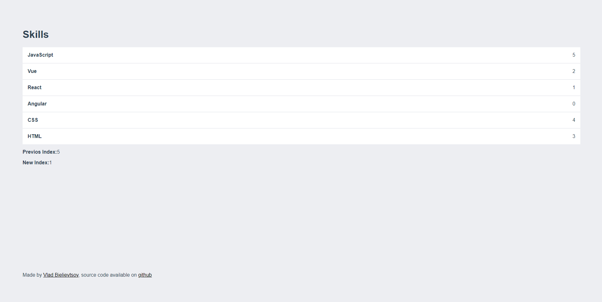

# draggable-list



:page_facing_up: Draggable list on Vue js by using [Vue.Draggable](https://github.com/SortableJS/Vue.Draggable)

Demo [click here](https://vladbielievtsov.com.ua/projects/draggable-list/)

## Project setup
```
npm install
```

### Compiles and hot-reloads for development
```
npm run serve
```

### Compiles and minifies for production
```
npm run build
```

### Customize configuration
See [Configuration Reference](https://cli.vuejs.org/config/).
